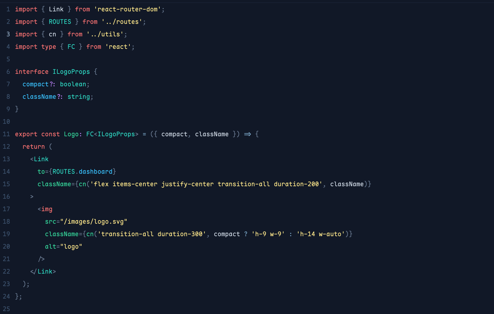
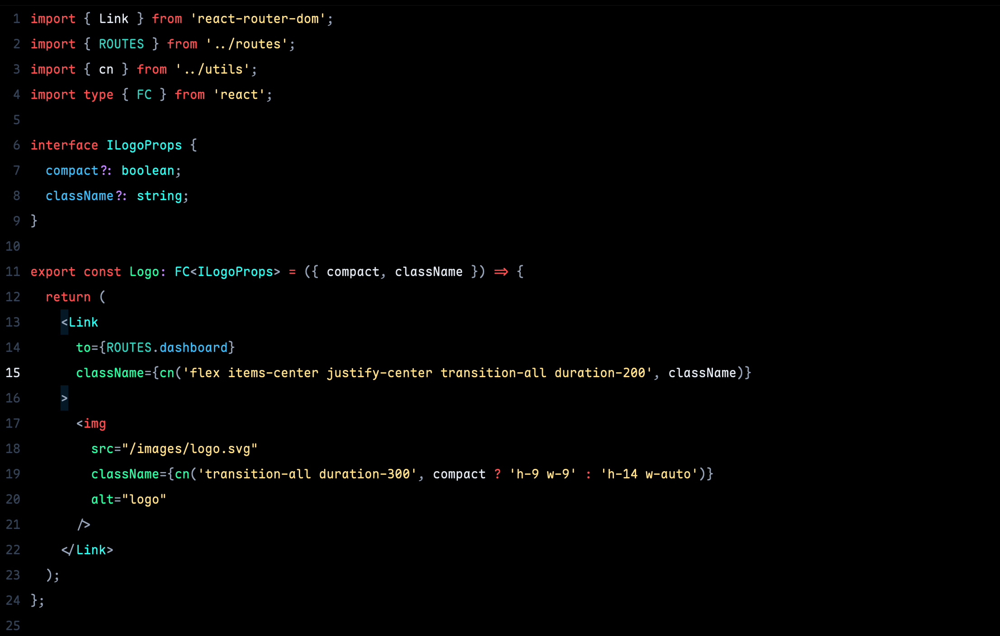

# Pace Pro

A refined theme family for [Zed](https://zed.dev) built on the Tailwind CSS color palette — clean, minimal, and easy on the eyes.

Three variants to match your setup and time of day.

---

## Variants

### Pace Dark

A deep navy dark theme with warm highlights and clear syntax differentiation.

---

### Pace Dark Pro OLED

Pure black background — designed for OLED displays where true black saves battery and looks stunning.

---

### Pace Light Pro

A clean minimal light theme. Every surface is white — no visual noise between the sidebar and editor.

---

## Color Philosophy

All three themes share the same syntax role mapping — only the intensity and background change between variants:

| Token         | Dark                  | OLED                 | Light                |
| ------------- | --------------------- | -------------------- | -------------------- |
| Keywords      | `#F87171` red-400     | `#F87171` red-400    | `#DC2626` red-600    |
| Strings       | `#FDE68A` amber-200   | `#FFE082` amber      | `#16A34A` green-700  |
| Functions     | `#34D399` emerald-400 | `#4ADE80` green-400  | `#16A34A` green-700  |
| Types         | `#2DD4BF` teal-400    | `#2DD4BF` teal-400   | `#0891B2` cyan-600   |
| Properties    | `#38BDF8` sky-400     | `#38BDF8` sky-400    | `#0284C7` sky-600    |
| Numbers       | `#C084FC` purple-400  | `#C084FC` purple-400 | `#9333EA` purple-600 |
| **Operators** | `#7BA7C8` muted blue  | `#7BA7C8` muted blue | `#0369A1` sky-800    |
| Comments      | `#4E6380`             | `#4E6380`            | `#94A3B8`            |

> Operators are intentionally separated from keywords — `=`, `?`, `=>` shouldn't shout as loud as `return` or `interface`.

---

## Installation

### Via Zed Extension Registry _(coming soon)_

Open Zed → `cmd+shift+p` → **zed: extensions** → search `Pace Pro`

### Manual

1. Download `pace-pro.json`
2. Copy to `~/.config/zed/themes/pace-pro.json`
3. Open Zed → `cmd+shift+p` → **theme selector: toggle** → select your variant

---

## Credits

Originally ported from [VS Code Pace Dark](https://marketplace.visualstudio.com/items?itemName=fabianhiller.pace-dark) by Fabian Hiller.

Refined and extended for Zed by **VitMach**.

---

## License

MIT © 2025 VitMach
